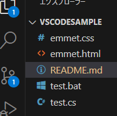

- [VSCodeSample](#vscodesample)
  - [今後のToDo](#今後のtodo)
- [次のステップ](#次のステップ)

# VSCodeSample

VSCodeの学習用のフォルダです

- VSCの使い方
- Gitのインストールと使い方
- GitHubの登録と使い方
- GitHub Copilot の学習
- GitHub Copolot Chat の学習

## 今後のToDo
> 引用文

ここを**強調**します

ここは*斜体*です

ここを~~打ち消し~~ます

---

ハイフンの区切り線

***

アスタリスクの区切り線

[Google](https://google.com)

[GitHub](https://github.com/okazaki-t5/VSCodeSample)

| 項番 | 説明  |
| ---: | :---: |
|    1 | Tako  |
|   20 |  Ika  |
|  300 | Wanko |

# 次のステップ

